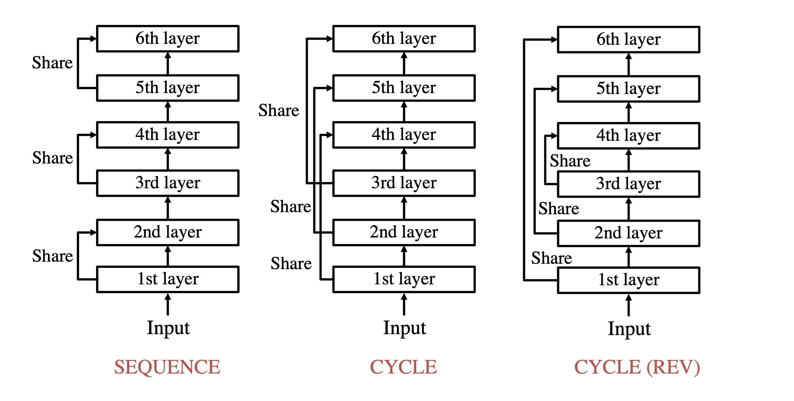

# Parameter Shared Transformer

</img>

PyTorch implementation of [Lessons on Parameter Sharing across Layers in Transformers](https://arxiv.org/abs/2104.06022v1).

## Quickstart

Clone this repository.

```
git clone https://github.com/jaketae/param-share-transformer.git
```

Navigate to the cloned directory. You can start using the model via

```
>>> from pshare_transformer import ParameterSharedTransformerEncoder
>>> model = ParameterSharedTransformerEncoder()
```

By default, the model comes with the following parameters:

```python
ParameterSharedTransformerEncoder(
    d_model=512,
    nhead=16,
    dim_feedforward=2048,
    dropout=0.1,
    activation="relu",
    num_unique_layers=3,
    num_total_layers=6,
    mode="cycle_rev",
    norm=False,
)
```

## Usage

You can check which layer is being used in each forward pass by toggling the `verbose` argument in the forward pass. By default `verbose` is set to `False`.

### Cycle Reverse

Below is a simple demonstration of the model's behavior when initialized in cycle reverse mode.

```python
>>> import torch
>>> x = torch.randn(8, 100, 512) # (batch_size, seq_len, d_model)
>>> from pshare_transformer import ParameterSharedTransformerEncoder
>>> model = ParameterSharedTransformerEncoder()
>>> model(x, verbose=True).shape
layer 0
layer 1
layer 2
layer 2
layer 1
layer 0
torch.Size([8, 100, 512])
```

The layers are "sandwiched" in the sense that the first layer is called again as the final layer; the second layer, the second to last, and so on.

### Cycle Mode

If the model is initialized in cycle mode, each layer is called again only after all preceding unique layers have been consumed.

```python
>>> model = ParameterSharedTransformerEncoder(mode="cycle")
>>> model(x, verbose=True).shape
>>> model(x, verbose=True).shape
layer 0
layer 1
layer 2
layer 0
layer 1
layer 2
torch.Size([8, 100, 512])
```

### Sequence Mode

In sequence mode, the model simply repeatedly calls a layer until moving onto the next in a sequential fashion.

```python
>>> model = ParameterSharedTransformerEncoder(mode="sequence")
>>> model(x, verbose=True).shape
layer 0
layer 0
layer 1
layer 1
layer 2
layer 2
torch.Size([8, 100, 512])
```

## Summary

The authors present three strategies for performing weight sharing on Transformer models: sequence, cycle, and cycle (rev).

We propose a parameter sharing method for Transformers (Vaswani et al., 2017). The proposed approach relaxes a widely used technique, which shares parameters for one layer with all layers such as Universal Transformers (Dehghani et al., 2019), to increase the efficiency in the computational time. We propose three strategies: Sequence, Cycle, and Cycle (rev) to assign parameters to each layer. Experimental results show that the proposed strategies are efficient in the parameter size and computational time. Moreover, we indicate that the proposed strategies are also effective in the configuration where we use many training data such as the recent WMT competition.

## Resources

- [Original Paper](https://arxiv.org/abs/2104.06022v1)
